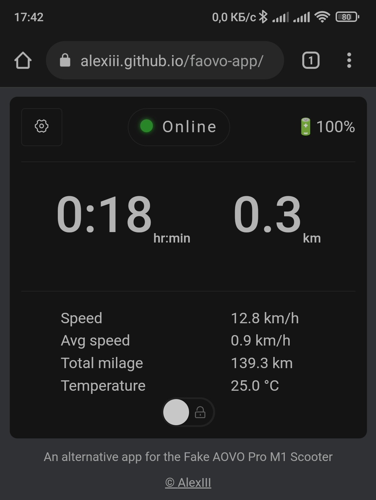

# Faovo - an alternative web app for the Fake AOVO Pro M1 Scooter

This is a web app for the clones of AOVO Pro M1 Scooter. It works entirely from browser and requires no install.

The app can also be used offline and can be installed on the main screen (PWA is not working from the github pages just yet, working on it).

This implementation is based on reverse-engineering of the BLE protocol via decompilation of the original 'LENZOD' Android app.

Consider this work highly experimental.

If you have a feature suggestion, or have found a bug, feel free to create an issue.

[And do try the app here!](https://alexiii.github.io/faovo-app/)

## What it can do

- Displays telemetry
  - Trip time
  - Trip distance
  - Battery charge
  - Current speed, average trip speed, total milage, scooter frame temperature
- Controls
  - Lock / Unlock (Note, this function provides no actual security. Your scooter can be locked/unlocked from any other phone with this or the original app.)
  - Cruise control On / Off
- Misc
  - User defined correction multiplier for the measured distance

## Limitations

The biggest limitation right now is to find functional Bluetooth API support in a browser.
[Web Bluetooth](https://webbluetoothcg.github.io/web-bluetooth/) has been in the works like 5 years and it's still considered "experimental". *sigh* 

## Compatible browsers

#### Windows

- ✔️ Google Chrome
- ✔️ Microsoft Edge

#### Android

- ✔️✖ Chrome
  - You will need to activate experimental features, for this navigate to `chrome://flags/#enable-experimental-web-platform-features`.
  The Bluetooth may not connect on the first try (or second, third, etc).
- ✖ Opera - theoretically supported, but failed to access Bluetooth capabilities
- ✖ Samsung Internet - theoretically supported, but failed to establish Bluetooth connection

#### iOS

Unfortunately, no mainstream browser supports Web Bluetooth under iOS as of this moment.
You can try alternatives, like [WebBLE](https://github.com/daphtdazz/WebBLE) or Bluefy.

## The reasons for replacement of the original app

LENZOD is a horrible app (on the inside too!). Here's some of the problems I couldn't simply live with.

- Every time it connects to the scooter it deletes **ALL** paired Bluetooth devices from the system. Your headphones, other accessories, gone.
- Obsessively wants you to register online for no good reason.
- Half of the controls simply do not work.
- Bizarre interface solutions, like displaying trip time as a number with one decimal (like 0.8 hours - wtf it that?).
- The interface is very noisy overall. It tries too hard to look like "cool sport car dashboard" it's ridiculous.
- I also needed additional functions, like the ability to correct imprecise distance measurements.

## How to determine if your AOVO Pro M1 is a fake one

1. No other app except LENZOD is working with the fake AOVO
2. Watch [this video](https://youtu.be/DFh4OfBI1Jg?t=1325)

## License

© github.com/AlexIII

MIT
