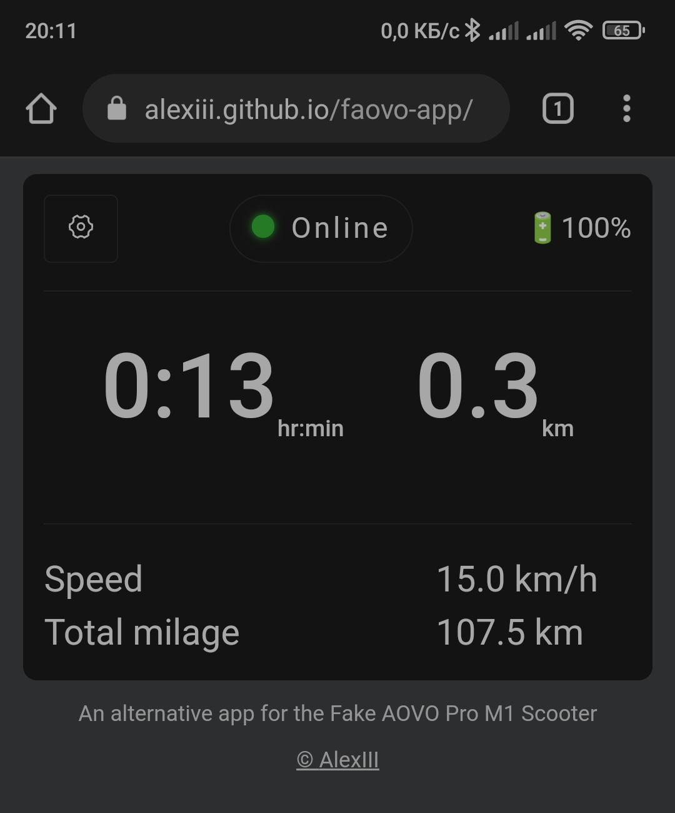

# Faovo - an alternative web app for the Fake AOVO Pro M1 Scooter

This is a web app for a clone of AOVO Pro M1 Scooter that works entirely from browser and requires no install.

The app can also be used offline and can be installed on the main screen (PWA is not working from github pages just yet, working on it).

This implementation is based on reverse-engineering of the BLE protocol via decompilation of the original 'LENZOD' Android app.

Consider this highly experimental.

[And do try it here!](https://alexiii.github.io/faovo-app/)

## Compatible browsers

- ✔️ Windows Google Chrome
- ✔️ Windows Edge
- ✔️✖ Android Chrome
  - You will need to activate experimental features, for this navigate to `chrome://flags/#enable-experimental-web-platform-features`.
  The Bluetooth may not connect on the first try.
- ❓ Android Opera - theoretically supported, not tested
- ❓ Samsung Internet - theoretically supported, not tested

## Reason

LENZOD is a horrible app (on the inside too!). I rest my case.

## How to determine if your AOVO Pro M1 is a fake

1. No other app except LENZOD is working with the fake AOVO
2. Watch [this video](https://youtu.be/DFh4OfBI1Jg?t=1325)

## TO-DO

- Add user input for correction coefficients for the speed and distance
- Add a switch for cruise control (on/off)
+ Do not show old values on app wake up
+ Add mean ride speed
- Add chrome "experimental features" in-app flag notification

## License

© github.com/AlexIII

MIT
